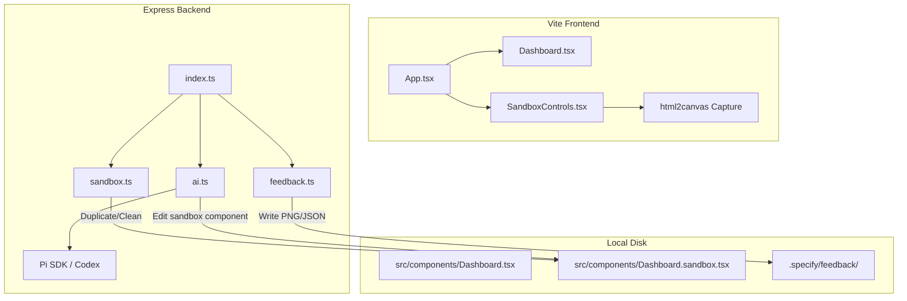
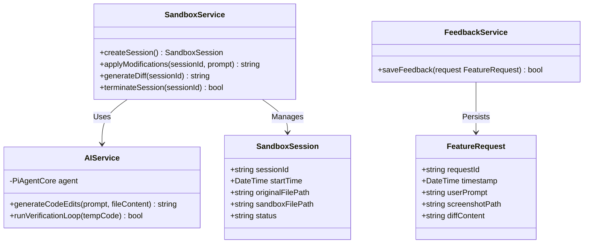
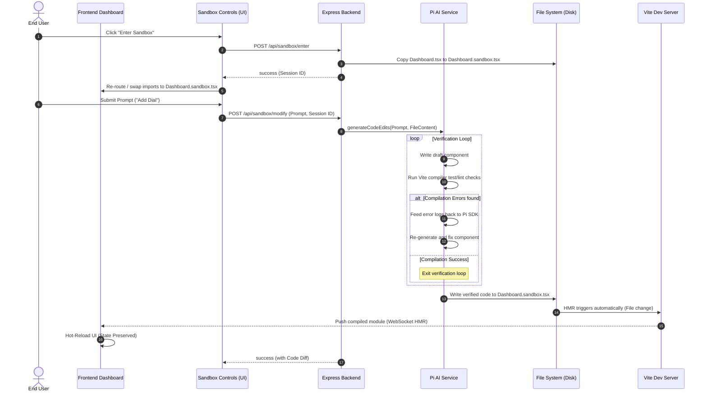
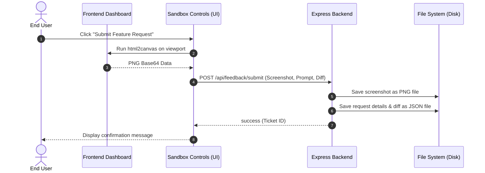

# Architecture Diagrams: Creator Sandbox & Feature Request Demo

This document captures the software engineering diagrams and flowcharts describing the system architecture, component relationships, data models, and sequences.

## 1. System Component Architecture
The application follows a decoupled client-server pattern. During Sandbox Mode, file imports dynamically swap to direct reads/writes on a sandbox component file.

---

## 2. Logical Data Model & Service Layer (Class Diagram)
This diagram illustrates the service boundaries, data classes, and their public interfaces.

---

## 3. Sequence Flow: Live Sandbox Code Evolution
This diagram represents the step-by-step lifecycle of submitting a modification prompt, executing the backend compilation/verification loop with error correction, and Vite HMR injecting changes without losing page state.

---

## 4. Sequence Flow: Feedback Visual Submission
This sequence covers visual snapshotting, diff generation, and saving feedback files.

